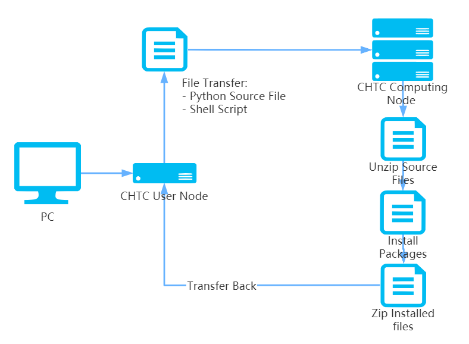
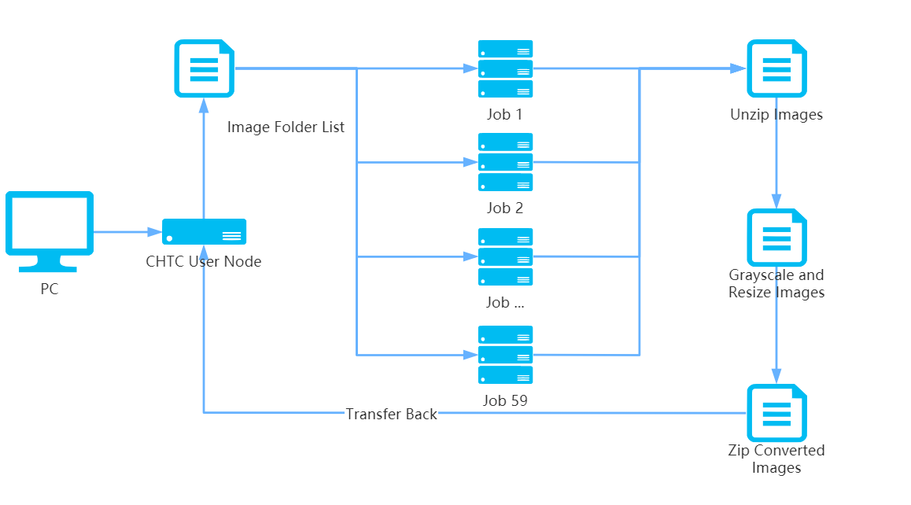
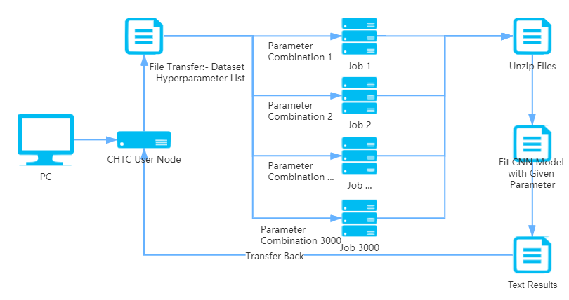

---
output:
  pdf_document: default
  html_document: default
---

# Stat 605 Final Project Report 1

# Group Members

Jiawei Huang (jhuang455)  
Yinqiu Xu (yxu475)  
Yike Wang (wang2557)  
Zijun Feng (zfeng66)  
Hao Jiang (hjiang266)

# Introduction

In this project, we are focusing on Fashion Product Images Dataset, which contains 44440 high-res product image files. Our purpose is to build a classifier based on CNN (Convolutional Neural Network), which can predict the category of a product by using its image. We use CHTC to improve the computational efficiency. To get an overall insight into the dataset and methodology feasibility, we show our workflow here (Figure 1).

{width=95%}

In general, we first preprocessed the image on CHTC to get dimensional reduced, grayscale image for model training. Then, we split these images into training set (60%), validation set (30%), and test set(10%). After that, we used parallel computation on CHTC to fit multiple CNN models under LeNet5 architecture with different hyperparameters on the training set in order to find the best hyperparameter combination. The accuracy of our final model on test set is 88%.

# Data Description

The dataset is sourced from Kaggle, which could be downloaded from http://www.kaggle.com/paramaggarwal/fashion-product-images-dataset. 

This dataset contains professionally shot high resolution product images, and multiple label attributes describing the product. More detailly, there're 44440 .jpg image files with fashion product, which could all be read into R as a $2400 \times 1800 \times 3$ dimensional array, where 2400 and 1800 represent the pixals in width and height respectively, 3 represent the RGB kernel for the image. For each image file, the product is centrally distributed. For image files in the same class, products share similar features. This ensures the feasibility of machine learning algorithms. Additionally, there's a style.csv file with multiple label attributes of the products: **gender, masterCategory, subCategory, articleType, baseColour, season, year, usage, product name**, which are extracted from the .josn metadata crawled from the internet. 

To perform image classification, we used **articleType** as category. It contains 144 classes in total, which are detailed product categories people usually refer to such as **Tshirts, Shirts, Shorts and Watches, etc.** We dropped categories whose counts are less than 500 and finally got 32618 images in 22 classes.


## Preparation

### Environment Preparation 

Both R and Python are used for different purposes in this project. R should be installed with package OpenImageR to preprocess the images and Python should be installed with several essential packages (numpy, torch, pandas, torchvision, PIL) to build a neural network. Therefore, two interactive jobs were created to first download necessary files, then install packages and finally return built files for R and Python respectively. We have learned about how to build R environment in class. To build up the Python environment, we followed the CHTC Python instruction[1]. More details can be found in the illustration below (Figure 2).

{width=55%}

### Image Preprocessing

In this step, we use R and OpenImageR package to convert original images into $32 \times 32$ grayscale images.

1. **Grayscale**  
Since we will be mostly deal with the shape of the clothing, we first convert the colored images with 3 RGB channels into grayscale images with only one single channel, through function:
$$Y_{Linear} = 0.2126*R_{Linear}+0.7152*G_{Linear}+0.0722B_{Linear}$$

2. **Dimensional reduction**  
We reduced the dimension of the images into $32 \times 32$, because it contains sufficient information about the shape of product and won't lead to a huge computational burden.

To complete image preprocessing efficiently, we divided and compressed all images into 59 .tgz files, then used CHTC to process these 59 .tgz files in parallel. More details can be found in the illustration below (Figure 3). After that, we split all 32618 images into training set (60%), validation set (30%), and test set(10%).

{width=60%}


## CNN Model

CNN is perfectly fitted for image data since it needs no flatten, can handle multi-dimensional matrix (like RGB image data), and performs exceptionally well on large datasets. A CNN model often contains dozens of hyperparameters, so there are millions of hyperparameter combinations. Even on CHTC, it is impossible to traverse all hyperparameters combinations and find the overall best model. Therefore, we decided to set several levels for each hyperparameter, and use random search to find high-performance combination.

More detailly, we built a CNN model with the structures of 2 Convolution Layer, 2 Max-Pooling Layer, and 5 FC Layer with LeNet rule, then ran parallel jobs on CHTC with the random selected hyperparameters from a table and compare their accuracy on validation set.

The structure of our neural network is described below:

1. **Convolution Layer and Max-Pooling Layer**  
We selected kernel 1 as a $K_1 \times K_1$ matrix. With the Kernel Size = $N_1$ and Stride Length = 1 in the first Convolution Layer, we got $N_1$ channels of $32 \times 32$ matrix through valid padding. After that, the Max-Pooling Layer halved the pixels in each channel to decrease computational power. As the kernel moves through the matrix with Stride Value = 1, the computer returns the maximum value from the portion of the image covered by the Pooling Kernel each time.  
In the second Convolution Layer, with a Kernel Size = $N_2$ and Stride Length = 1, we got $N_2$ channels of $16 \times 16$ matrix through valid padding. The second Max-Pooling Layer is applied after that to transform the previous result into $8 \times 8 \times N_2$. 

2. **Fully Connected Layer**  
After converting the image into multi-channels from our Multi-level Perceptron, we can flatten it into a column vector and go through two hidden layers with dimension $H_1$ and $H_2$. Over a series of epochs using **LeNet5**, the model can distinguish the domain features in images and classify them through **Softmax** method.


# Hyperparameter tuning

In this part, we did hyperparameter tuning by random search. In our first draft, we only compared 600 hyperparameter combinations. In our final draft, we adjusted the range of hyperparameters based on previous result and compared 3000 hyperparameter combinations. The following figure illustrate how we get all accuracy for 3000 hyperparameter combinations in parallel by using CHTC (Figure 4). More details will be introduced in the following.

\newpage

{width=60%}


## First Try

After building up the CNN model in Python, we used CHTC to do hyperparameter tuning efficiently[2]. The following table shows the range of each hyperparameter in our first draft:

| Hyperparameter | Annocatation | Value |
|---|:---:|:---:|
| Filter Numeber 1 | $N_1$  | [4,8,12] |
| Kernel  Size 1 | $K_1$ | [3,5] |
| Filter Numeber 2 | $N_1$ | [24,32,48] |
| Kernel  Size 2 | $K_2$ | [3,5] |
| Hidden Layer 1 | $H_1$ | [80,100,120] |
| Hidden Layer 2 | $H_2$ | [40,50,60] |
| Learning Rate | $R$ | [0.001,0.003,0.01,0.03] |
| Batch Size | $S$ | [32,64,128,256] |


We submitted 600 parallel jobs on CHTC to fit 600 CNN models (epoch_num=15) with random combination of hyperparameters from the table. The whole process took about 2 hours. After all jobs have been completed, we compared their validation accuracy. The highest validation accuracy is 87.66%. The corresponding hyperparameters combination is filter_num1=12, kernel_size1=3, filter_num2=32, kernel_size2=3, hidden_layer1=120, hidden_layer2=40, learning_rate=0.001 and batch_size=64.

Some hyperparameter combinations lead to very low accuracy (less than 30%). For example, with learning_rate=0.03, many accuracy were around 20%, which turned out 0.03 is a bad choice for learning_rate.

Here we provide several examples to illustrate how hyperparameters can affect model performance. We only consider data with accuracy greater than 30%.

```{r, echo=FALSE, fig.show="hold", out.width="42%", fig.align = "center"}
library(ggplot2)
options(scipen = 200)

acc = read.csv("CNN/all_res_600.csv", header=T)
acc = acc[acc$validation_accuracy>30,]

filter_num1 = tapply(acc$validation_accuracy, acc$filter_num1 ,mean)
filter_num1 = data.frame(filter_num1 = factor(names(filter_num1),levels = c(4,8,12)),
                   validation_accuracy = filter_num1, group="")
ggplot(filter_num1,aes(x=filter_num1,y=validation_accuracy)) + 
  geom_line(aes(group = group),color=blues9[3],size=2) +
  geom_point(size=4,color=blues9[9]) + ylim(70,90) +
        theme_minimal() + 
            labs(title="Scatterplot for average accuracy on filter number 1",
           x="filter number 1",
           y="Average Validation Accuracy") +
      theme(
            plot.title = element_text(size = 18,hjust = 0.5),
            plot.subtitle = element_text(size = 12, face = "bold", hjust = 0.8),
            plot.caption = element_text(size = 12, face = "italic"),
            axis.text = element_text(size=12),
            axis.title = element_text(size=14),
            legend.title = element_text(size=14,face="bold"))

filter_num2 = tapply(acc$validation_accuracy, acc$filter_num2 ,mean)
filter_num2 = data.frame(filter_num2 = factor(names(filter_num2),levels = c(24,32,48)),
                   validation_accuracy = filter_num2, group="")
ggplot(filter_num2,aes(x=filter_num2,y=validation_accuracy)) + 
  geom_line(aes(group = group),color=blues9[3],size=2) +
  geom_point(size=4,color=blues9[9]) + ylim(70,90) +
        theme_minimal() + 
            labs(title="Scatterplot for average accuracy on filter number 2",
           x="filter number 2",
           y="Average Validation Accuracy") +
      theme(
            plot.title = element_text(size = 18,hjust = 0.5),
            plot.subtitle = element_text(size = 12, face = "bold", hjust = 0.8),
            plot.caption = element_text(size = 12, face = "italic"),
            axis.text = element_text(size=12),
            axis.title = element_text(size=14),
            legend.title = element_text(size=14,face="bold"))

lrate = tapply(acc$`validation_accuracy`, acc$learning_rate,mean)
lrate = data.frame(learning_rate = factor(names(lrate),levels = c(0.001,0.003,0.01,0.03)),
                   validation_accuracy = lrate, group="")
ggplot(lrate,aes(x=learning_rate,y=validation_accuracy)) + 
  geom_line(aes(group = group),color=blues9[3],size=2) +
  geom_point(size=4,color=blues9[9]) + 
        theme_minimal() + 
      labs(title="Scatterplot for average accuracy on Learning Rate",
           x="Learning Rate",
           y="Average Validation Accuracy") +
      theme(
            plot.title = element_text(size = 18,hjust = 0.5),
            plot.subtitle = element_text(size = 12, face = "bold", hjust = 0.8),
            plot.caption = element_text(size = 12, face = "italic"),
            axis.text = element_text(size=12),
            axis.title = element_text(size=14),
            legend.title = element_text(size=14,face="bold"))

batch_size = tapply(acc$`validation_accuracy`, acc$batch_size ,mean)
batch_size = data.frame(batch_size = factor(names(batch_size),levels = c(32,64,128,256)),
                   validation_accuracy = batch_size, group="")
ggplot(batch_size,aes(x=batch_size,y=validation_accuracy)) + 
  geom_line(aes(group = group),color=blues9[3],size=2) +
  geom_point(size=4,color=blues9[9]) + ylim(70,90) +
        theme_minimal() + 
            labs(title="Scatterplot for average accuracy on Batch Size",
           x="Batch Size",
           y="Average Validation Accuracy") +
      theme(
            plot.title = element_text(size = 18,hjust = 0.5),
            plot.subtitle = element_text(size = 12, face = "bold", hjust = 0.8),
            plot.caption = element_text(size = 12, face = "italic"),
            axis.text = element_text(size=12),
            axis.title = element_text(size=14),
            legend.title = element_text(size=14,face="bold"))


```

We also got an insight into the importance of hyperparameters through ANOVA by assigning each hyperparameter as an effect[3]. With the main effects and second level interactions included, we got 36 effects and evaluated their significance through Bonferroni Correction, that is, extracting all terms with $p < 0.05/36 = 0.0013$ as significant. It turns out that 18 out of 36 effects are significant, suggesting our hyperparameter tuning is meaningful. Therefore, we decided to perform a second hyperparameter tuning on more reasonable divisions and larger intervals.

## New Design

Our result from the first draft gave us a reference to preform the second hyperparameter tuning. We adjusted the range of hyperparameters based on the result of our first try:

| Hyperparameter | Annocatation | Value |
|---|:---:|:---:|
| Filter Numeber 1 | $N_1$  | [4,8,12,16] |
| Kernel  Size 1 | $K_1$ | [3,5] |
| Filter Numeber 2 | $N_1$ | [32,48,64,80] |
| Kernel  Size 2 | $K_2$ | [3,5] |
| Hidden Layer 1 | $H_1$ | [120,160,200] |
| Hidden Layer 2 | $H_2$ | [20,40,60] |
| Learning Rate | $R$ | [0.0001,0.0002,0.0005,0.001,0.002,0.005,0.01] |
| Batch Size | $S$ | [16,32,64,128,256,512] |

This time, we randomly generated 3000 different combinations of hyperparameters. Then, we submitted 3000 parallel jobs on CHTC to fit 3000 CNN models (epoch_num=15) with different combination of hyperparameters.

The whole process took about 8 hours. After all jobs have been completed, we compared their validation accuracy. The highest validation accuracy in all 3000 models is 88.36%, with training time 2996s. The corresponding hyperparameters combination is filter_num1=16, kernel_size1=3, filter_num2=80, kernel_size2=5, hidden_layer1=200, hidden_layer2=40, learning_rate=0.0005 and batch_size=64.

Note that: if we focus on models with validation accuracy larger than 88% and order them by running time, we could find that the model with highest training accuracy also took the longest training time among them. Therefore, if we'd like to consider trade-off for time, it's also a good idea to choose another model with validation accuracy 88.00% and training time 1168s. The corresponding hyperparameters combination is filter_num1=12, kernel_size1=3, filter_num2=64, kernel_size2=3, hidden_layer1=120, hidden_layer2=60, learning_rate=0.002 and batch_size=256. In this way, we can save about 2/3 of the training time.

Here we also provide several examples to illustrate how hyperparameters can affect model performance. We only consider data with accuracy greater than 30%. 

```{r, echo=FALSE, fig.show="hold", out.width="42%", fig.align = "center"}
library(ggplot2)

acc = read.table("CNN/all_res.txt", sep=" ", header = TRUE)
acc = acc[acc$validation_accuracy>30,]

filter_num1 = tapply(acc$validation_accuracy, acc$filter_num1 ,mean)
filter_num1 = data.frame(filter_num1 = factor(names(filter_num1),levels = c(4,8,12,16)),
                   validation_accuracy = filter_num1, group="")
ggplot(filter_num1,aes(x=filter_num1,y=validation_accuracy)) + 
  geom_line(aes(group = group),color=blues9[3],size=2) +
  geom_point(size=4,color=blues9[9]) + ylim(70,90) +
        theme_minimal() + 
            labs(title="Scatterplot for average accuracy on filter number 1",
           x="filter number 1",
           y="Average Validation Accuracy") +
      theme(
            plot.title = element_text(size = 18,hjust = 0.5),
            plot.subtitle = element_text(size = 12, face = "bold", hjust = 0.8),
            plot.caption = element_text(size = 12, face = "italic"),
            axis.text = element_text(size=12),
            axis.title = element_text(size=14),
            legend.title = element_text(size=14,face="bold"))

filter_num2 = tapply(acc$validation_accuracy, acc$filter_num2 ,mean)
filter_num2 = data.frame(filter_num2 = factor(names(filter_num2),levels = c(32,48,64,80)),
                   validation_accuracy = filter_num2, group="")
ggplot(filter_num2,aes(x=filter_num2,y=validation_accuracy)) + 
  geom_line(aes(group = group),color=blues9[3],size=2) +
  geom_point(size=4,color=blues9[9]) + ylim(70,90) +
        theme_minimal() + 
            labs(title="Scatterplot for average accuracy on filter number 2",
           x="filter number 2",
           y="Average Validation Accuracy") +
      theme(
            plot.title = element_text(size = 18,hjust = 0.5),
            plot.subtitle = element_text(size = 12, face = "bold", hjust = 0.8),
            plot.caption = element_text(size = 12, face = "italic"),
            axis.text = element_text(size=12),
            axis.title = element_text(size=14),
            legend.title = element_text(size=14,face="bold"))

lrate = tapply(acc$`validation_accuracy`, acc$learning_rate,mean)
lrate = data.frame(learning_rate = factor(names(lrate),levels = c(0.0001,0.0002,0.0005,0.001,0.002,0.005,0.01)),
                   validation_accuracy = lrate, group="")
ggplot(lrate,aes(x=learning_rate,y=validation_accuracy)) + 
  geom_line(aes(group = group),color=blues9[3],size=2) +
  geom_point(size=4,color=blues9[9]) + 
        theme_minimal() + 
      labs(title="Scatterplot for average accuracy on Learning Rate",
           x="Learning Rate",
           y="Average Validation Accuracy") +
      theme(
            plot.title = element_text(size = 18,hjust = 0.5),
            plot.subtitle = element_text(size = 12, face = "bold", hjust = 0.8),
            plot.caption = element_text(size = 12, face = "italic"),
            axis.text = element_text(size=12),
            axis.title = element_text(size=14),
            legend.title = element_text(size=14,face="bold"))

batch_size = tapply(acc$`validation_accuracy`, acc$batch_size ,mean)
batch_size = data.frame(batch_size = factor(names(batch_size),levels = c(16,32,64,128,256,512)),
                   validation_accuracy = batch_size, group="")
ggplot(batch_size,aes(x=batch_size,y=validation_accuracy)) + 
  geom_line(aes(group = group),color=blues9[3],size=2) +
  geom_point(size=4,color=blues9[9]) + ylim(70,90) +
        theme_minimal() + 
            labs(title="Scatterplot for average accuracy on Batch Size",
           x="Batch Size",
           y="Average Validation Accuracy") +
      theme(
            plot.title = element_text(size = 18,hjust = 0.5),
            plot.subtitle = element_text(size = 12, face = "bold", hjust = 0.8),
            plot.caption = element_text(size = 12, face = "italic"),
            axis.text = element_text(size=12),
            axis.title = element_text(size=14),
            legend.title = element_text(size=14,face="bold"))


```

Based on these plots, we can find 8 hyperparameters with highest average validation accuracy. However, compared with our final models, the combination of these hyperparameters leads to a lower validation accuracy 87.51%. Therefore, the relationship between hyperparameters and validation accuracy is very complex. This confirms the necessity of random search in hyperparameter tuning.

## Final Model

By using CHTC, we figured out the best combination of hyperparameters among 3000 candidates efficiently. Then, We fitted a final model with data in both training and validation sets based on these hyperparameters, and used the test dataset which had not been used before to evaluate the perfermance of this model.

```{r, echo=FALSE, out.width = '55%', fig.align = "center"}
acc1<-c(75.439, 83.471, 86.905, 88.762, 90.438, 92.298, 91.954, 94.331, 94.941, 95.667, 97.057, 97.166, 97.012, 98.062, 98.607)/100
acc2<-c(75.238, 82.378, 84.707, 85.749, 85.933, 86.853, 86.424, 86.577, 87.251, 87.680, 87.741, 87.128, 87.128, 87.803, 88.140)/100
plot(1:15, acc1, type="l", col="blue", ylim=c(0.7, 1), cex.lab=1.2, cex.main=1.2, lty=2, 
     main="Accuracy in each Epoch",
     xlab="Epoch", ylab="Accuracy", lwd=2)
abline(h=0.88140, col="grey", lty=3, lwd=2)
lines(1:15, acc2, type="l", col="red", lwd=2, lty=1)
legend("bottomright", legend=c("Training accuracy", "Test accuracy"),
       col=c("blue", "red"), lty=c(2, 1), cex=1.2)
```


The accuracy plot shows that: As the number of epoch increasing, the training accuracy keep increasing and is approaching to 100%, while the test accuracy also keep increasing at first but stabilize at about 88%. It prove that our final model has a good performance on product images classification.


# Conclusion

In this project, we build a classifier based on CNN, which can predict the category of a product by using its image with accuracy more than 88%. By using CHTC, we speed up our pipeline in 2 steps: 1. data preprocessing for more than 30 thousand images. 2. hyperparameter tuning among 3 thousand combinations. The jobs in each step are independent and time-consuming, so there is no doubt that parallel computing is a great method to save our time.

Finally, we have some thoughts about our project:

1. Since we are not very proficient in CNN, there might be some details in model design that can be improved. However, we still think this is a wonderful practice for us to get familiar with CHTC and parallel computing.

2. Due to the time complexity, we resized the image into grayscale $32 \times 32$ to make sure most jobs could be finished within 1 hour, which might constrain our validation accuracy below 90%. For future work, we may consider using images with larger size to increase the performance.


# Reference

1. CHTC Official Website: Running Python Jobs on CHTC: https://chtc.cs.wisc.edu/python-jobs.shtml

2. Hutter F, Hoos H, Leyton-Brown K. An efficient approach for assessing hyperparameter importance[C]. International conference on machine learning. PMLR, 2014: 754-762.

3. Aszemi N M, Dominic P D D. Hyperparameter Optimization in Convolutional Neural Network using Genetic Algorithms[J].

