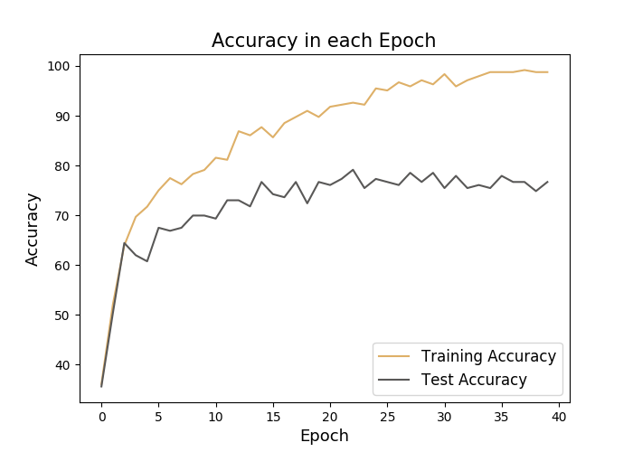

---
output:
  pdf_document: default
  html_document: default
---

# Stat 605 Final Project Report 1

# Group Members

Jiawei Huang (jhuang455)
Yinqiu Xu (yxu475)
Yike Wang (wang2557)
Zijun Feng (zfeng66)
Hao Jiang (hjiang266)

# Data Description and Usage

In the final project, we are focusing on Fashion Product Images Dataset, which contains 42409 high-res product image files. We perform dimension reduction and classification with "articleType" label as output. The dataset is sourced from Kaggle, which could be downloaded from http://www.kaggle.com/paramaggarwal/fashion-product-images-dataset.

This dataset contains professionally shot high resolution product images, and multiple label attributes describing the product which was manually entered while cataloging. More detailly,

1.	There're 42409 .jpg image files with fashion product, which could all be read into R as a 2400 × 1800 × 3 dimensional array, where 2400 and 1800 represent the pixals in width and height respectively, 3 represent the RGB kernel for the image. 

2.	For each image file, the product is centrally distributed. For image files in the same class, products share similar features. This ensures the feasibility of machine learning algorithms.

3.	There's a style.csv file with multiple label attributes of the products: **gender, masterCategory, subCategory, articleType, baseColour, season, year, usage, product name**, which are extracted from the .josn metadata crawled from the internet. 

To perform image classification, we used articleType as category. It contains 144 classes in total, which are detailed product categories people usually refer to such as **Tshirts, Shirts, Shorts and Watches, etc.** We intended to drop categories whose count are less than 500 and finally got 22 classes.

To gain an overall insight into the dataset and methodology feasibility, we performed our work flow on a subset of original dataset. 

# Workflow and Methodology
{width=90%}

## Pre-pocessing

1. **Grayscale** Since we will be mostly deal with the shape of the clothing and color can be directly read from the image, we first convert the colored images with three RGB channels into black and white images with only one single channel. Through function:
$$Y_{Linear} = 0.2126*R_{Linear}+0.7152*G_{Linear}+0.0722B_{Linear}$$
2. **Dimensional reduction** Original number of pixels of an image is beyond the computational power of PC and even hard for high-performance clusters. Thus, we will reduce the dimension of the images. We have tried different dimensions as demonstrated below. Finally, we decided on $32 \times 32$, which contains sufficient information about the shape and is a reasonable number of pixels to fit models.

## CNN

The pre-processing part indeed takes time but can still achieve by a local PC. So what can we do in CHTC? Our answer is a **Convolutional Neural Network (CNN)**. CNN is perfectly fitted for image data since it needs no flatten, can handle multi-dimensional matrix (like RGB image data), and performs exceptionally well in large datasets. We build a CNN model with the structures of 2 Convolution Layer, 2 Max-Pooling Layer, and 5 FC Layer with LeNet rule. 

1. **Convolution Layer and Max-Pooling Layer** 

In our toy example, We selected kernel K as a $5 \times 5 \times 1$ matrix. With the Kernel Size = 6 and Stride Length = 1 in the first Convolution Layer, we got 6 channels of $28 \times 28$ matrix through valid padding. After that, the Max-Pooling Layer halved the pixels in each channel to decrease computational power. This is achieved and as the kernel moves through the matrix with Stride Value = 1, the computer returns the maximum value from the portion of the image covered by the Pooling Kernel each time.

In the second Convolution Layer, with a Kernel Size = 16 and Stride Length = 1, we got 16 channels of $10 \times 10$ matrix through valid padding. The second Max-Pooling Layer is applied after that to finalize our dataset to be $5 \times 5 \times 16$. 

2. **Fully Connected Layer** 

Now that we have converted the image into multi-channels from our Multi-level Perceptron, we can flatten it into a column vector. Over a series of epochs using **LeNet5**, the model can distinguish the domain features and classify them through **Softmax** method.

# Results

{width=50%}

We compressed the first 500 images into $32 \times 32$ and took out 407 images in 8 main categories as a **toy** dataset. Then, we split this dataset into training set (60%) and test set (40%). We fitted an LeNet5 CNN model with Learning Rate = 0.001, Batch Size = 32, and Epochs = 40. The accuracy plot showed that: As the number of epoch increasing, the training accuracy kept increasing and was approaching to 100%, while the test accuracy also kept increasing at first but stabilized at about 75%. The result was resonable because we were working on a very samll toy dataset. It proved that our model was feasible and could be generalized & applied to a larger dataset. 

# Future works

We have proved the feasibility of our method. In the future, CHTC can help with our Convolutional Neural Network in 2 ways to establish a more appliable distinguish model.

1. **More data** 

Instead of using only around 500 images for now, with the help of CHTC, we can achieve a CNN model with a considerable size dataset to improve its overall performance.

2. **Hyperparameter turning** 

Several hyperparameters can be changed to find the best combination. We can test the hyperparameters to fit the model of best accuracy.

- Total layer of network
- Kernel Size for each Layer
- Max-Pooling or Ave-Pooling
- Architectures of FC Layer (LeNet, AletNet, VGGNet, etc.)

