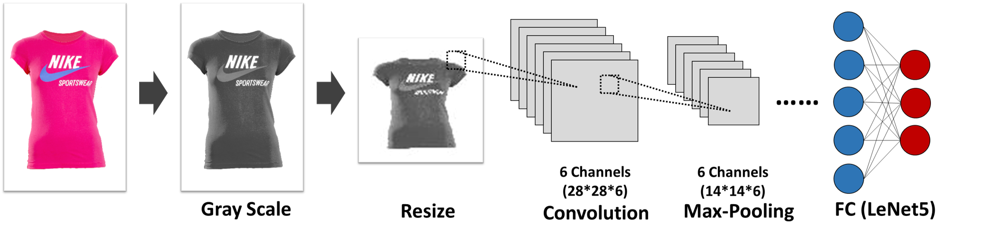

---
output:
  pdf_document: default
  html_document: default
---

# Stat 605 Final Project Report 1

# Group Members

Jiawei Huang (jhuang455)  
Yinqiu Xu (yxu475)  
Yike Wang (wang2557)  
Zijun Feng (zfeng66)  
Hao Jiang (hjiang266)

# Introduction

In this project, we are focusing on Fashion Product Images Dataset, which contains 44440 high-res product image files. Our purpose is to build a classifier based on CNN (Convolutional Neural Network), which can predict the category of a product by using its image. We use CHTC to improve the computational efficiency.

To gain an overall insight into the dataset and methodology feasibility, we performed our workflow here. Detailly, we first pre-pressed the image on CHTC to get and dimensional reduced, grayscale image for model training. After that, we split the set into training set (60%), validation set (30%), and test set(10%). We use parallel computation on CHTC to fit multiple CNN models under LeNet5 architecture with different hyperparameters on the training set to gain an insight into what the hyperparameters should be used, and prepare for the larger scale hyperparameter tuning in the future. 



# Data Description and Summary

The dataset is sourced from Kaggle, which could be downloaded from http://www.kaggle.com/paramaggarwal/fashion-product-images-dataset. 

This dataset contains professionally shot high resolution product images, and multiple label attributes describing the product which was manually entered while cataloging. More detailly, there're 44440 .jpg image files with fashion product, which could all be read into R as a $2400 \times 1800 \times 3$ dimensional array, where 2400 and 1800 represent the pixals in width and height respectively, 3 represent the RGB kernel for the image. For each image file, the product is centrally distributed. For image files in the same class, products share similar features. This ensures the feasibility of machine learning algorithms. Additionally, there's a style.csv file with multiple label attributes of the products: **gender, masterCategory, subCategory, articleType, baseColour, season, year, usage, product name**, which are extracted from the .josn metadata crawled from the internet. 

To perform image classification, we used articleType as category. It contains 144 classes in total, which are detailed product categories people usually refer to such as **Tshirts, Shirts, Shorts and Watches, etc.** We intended to drop categories whose count are less than 600 and finally got 32618 images in 22 classes.

## Pre-pocessing

**Detail description of preprocessing**

1. **Grayscale**  
Since we will be mostly deal with the shape of the clothing and color can be directly read from the image, we first convert the colored images with 3 RGB channels into black and white images with only one single channel. Through function:
$$Y_{Linear} = 0.2126*R_{Linear}+0.7152*G_{Linear}+0.0722B_{Linear}$$
2. **Dimensional reduction**  
Original number of pixels of an image is beyond the computational power of PC and even hard for high-performance clusters. Thus, we will reduce the dimension of the images.We decided on $32 \times 32$, which contains sufficient information about the shape and is a reasonable number of pixels to fit models.

## CNN

CNN is perfectly fitted for image data since it needs no flatten, can handle multi-dimensional matrix (like RGB image data), and performs exceptionally well in large datasets. A CNN model often contains dozens of hyperparameters, and there are millions of hyperparameter combinations. Even on CHTC, it is impossible to traverse all the hyperparameters and find the best model. Therefore, we decided to set several levels for each hyperparameter, and use random search to find high-performance combination.

| Hyperparameter | Annocatation | Value |
|---|:---:|:---:|
| Filter Numeber 1 | $N_1$  | [4,8,12] |
| Kernel  Size 1 | $K_1$ | [3,5] |
| Filter Numeber 2 | $N_1$ | [24,32,48] |
| Kernel  Size 2 | $K_2$ | [3,5] |
| Hidden Layer 1 | $H_1$ | [120,100,80] |
| Hidden Layer 2 | $H_2$ | [60,50,40] |
| Learning Rate | $R$ | [0.001,0.003,0.01,0.03] |
| Batch Size | $S$ | [32,64,128,160] |

More detailly, we build a CNN model with the structures of 2 Convolution Layer, 2 Max-Pooling Layer, and 5 FC Layer with LeNet rule, run 600 parallel jobs on CHTC with the random selected hyperparameters from the table above, compare their accuracy on validation set, and finally get a summarization of the performance for different hyperparameters. The structure of our neural network is described below:

1. **Convolution Layer and Max-Pooling Layer**  
We selected kernel K as a $K_1 \times K_1 \times 1$ matrix. With the Kernel Size = $N_1$ and Stride Length = 1 in the first Convolution Layer, we got $N_1$ channels of $32 \times 32$ matrix through valid padding. After that, the Max-Pooling Layer halved the pixels in each channel to decrease computational power. This is achieved and as the kernel moves through the matrix with Stride Value = 1, the computer returns the maximum value from the portion of the image covered by the Pooling Kernel each time.  
In the second Convolution Layer, with a Kernel Size = $K_2$ and Stride Length = 1, we got $K_2$ channels of $16 \times 16$ matrix through valid padding. The second Max-Pooling Layer is applied after that to finalize our dataset to be $8 \times 8 \times K_2$. 

2. **Fully Connected Layer**  
Now that we have converted the image into multi-channels from our Multi-level Perceptron, we can flatten it into a column vector and go through two hidden layers with dimension $H_1$ and $H_2$. Over a series of epochs using **LeNet5**, the model can distinguish the domain features and classify them through **Softmax** method.

# Results

We submitted 600 parallel jobs on CHTC to fit 600 CNN models with different combination of hyperparameters. The whole process took about 3 hours. After all jobs have been completed, we compared their validation accuracy. Here we provide two examples to illustrate how hyperparameters can affect model performance:

```{r, echo=FALSE, figures-side, fig.show="hold", out.width="45%", fig.align = "center"}
library(ggplot2)
acc = read.table("all_res.txt")
para = read.csv("randomSearchCNN.csv")
colnames(acc) = c("id",colnames(para),"train_accuracy","validation_accuracy")
para$id = 0:999
acc$learning_rate = para$learning_rate[match(acc$id,para$id)]
lrate = tapply(acc$`validation_accuracy`, acc$learning_rate,mean)
lrate = data.frame(learning_rate = factor(names(lrate)),validation_accuracy = lrate,group="")
ggplot(lrate,aes(x=learning_rate,y=validation_accuracy)) + 
  geom_line(aes(group = group),color=blues9[3],size=2) +
  geom_point(size=4,color=blues9[9]) + 
        theme_minimal() + 
      labs(title="Scatterplot for average accuracy on Learning Rate",
           x="Learning Rate",
           y="Average Validation Accuracy") +
      theme(
            plot.title = element_text(size = 18,hjust = 0.5),
            plot.subtitle = element_text(size = 12, face = "bold", hjust = 0.8),
            plot.caption = element_text(size = 12, face = "italic"),
            axis.text = element_text(size=12),
            axis.title = element_text(size=14),
            legend.title = element_text(size=14,face="bold"))

lrate = tapply(acc$`validation_accuracy`, acc$batch_size ,mean)
lrate = data.frame(batch_size = factor(names(lrate),levels = c("32","64","128","256")),validation_accuracy = lrate,group="")
ggplot(lrate,aes(x=batch_size,y=validation_accuracy)) + 
  geom_line(aes(group = group),color=blues9[3],size=2) +
  geom_point(size=4,color=blues9[9]) + ylim(40,70) +
        theme_minimal() + 
            labs(title="Scatterplot for average accuracy on Batch Size",
           x="Batch Size",
           y="Average Validation Accuracy") +
      theme(
            plot.title = element_text(size = 18,hjust = 0.5),
            plot.subtitle = element_text(size = 12, face = "bold", hjust = 0.8),
            plot.caption = element_text(size = 12, face = "italic"),
            axis.text = element_text(size=12),
            axis.title = element_text(size=14),
            legend.title = element_text(size=14,face="bold"))
```


The highest validation accuracy in all 600 models is 87.66%. The corresponding hyperparameters combination is filter_num1=12, kernel_size1=3, filter_num2=32, kernel_size2=3, hidden_layer1=120, hidden_layer2=40, learning_rate=0.001 and batch_size=64. We'll use these hyperparameters to fit a new model with data in both training and validation sets, and then use the "secret" test dataset to evaluate the perfermance of this model.

```{r, echo=FALSE, out.width = '55%', fig.align = "center"}
acc1<-c(0.74641, 0.82119, 0.85430, 0.86350, 0.88970, 0.89644, 0.91746, 0.92087, 0.93681, 0.94205, 0.94812, 0.95255, 0.96174, 0.96989, 0.97377)
acc2<-c(0.74625, 0.81489, 0.82869, 0.82654, 0.85290, 0.85719, 0.86638, 0.86393, 0.86914, 0.87067, 0.86148, 0.86791, 0.87220, 0.87251, 0.87006)
plot(1:15, acc1, type="l", col="blue", ylim=c(0.7, 1), cex.lab=1.2, cex.main=1.2, lty=2, 
     main="Accuracy in each Epoch",
     xlab="Epoch", ylab="Accuracy", lwd=2)
lines(1:15, acc2, type="l", col="red", lwd=2, lty=1)
legend("bottomright", legend=c("Training accuracy", "Test accuracy"),
       col=c("blue", "red"), lty=c(2, 1), cex=1.2)
```


The accuracy plot showed that: As the number of epoch increasing, the training accuracy kept increasing and was approaching to 100%, while the test accuracy also kept increasing at first but stabilized at about 87%. It proved that our final model has a good performance on product images classification.


# Future work

We have proved the feasibility of our method and gain a basic insight of how the hyperparameters controls the training accuracy. In the future, we plan to complete our work from the following prospectives. 

1. **Finding the best hyperparameter setting.**  
Until now, we only run hundreds of parallel models, which is far from drawing the valid conclusion that what hyperparameters values would be optimal. We plan to evaluate the performance of thousands of hyperparameters' combination on our fashion product image dataset to find our final model. Also, with the results of previous model training, we can reset the hyperparameter levels into a more resaonable subset. 

2. **Adding other hyperparameters (if appliable).**  
There are other hyperparameters that we didn't take into account this time. For eaxmple, **Total layer of Network**, **Max-Pooling or Ave-Pooling**, and **Architectures of FC Layer (LeNet, AletNet, VGGNet, etc.)**. If appliable, we are also willing to try tuning these hyperparameters.


